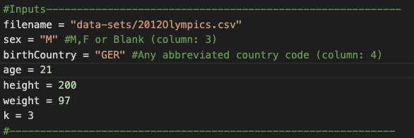

# K-Nearest Neighbor Implementation & Application (Python)

**OVERVIEW**
 
Given sex, country of birth, age, weight and height this model returns the sport most suited to you based on a data set from the 2012 Olympic Games.
  
The date set is first filtered by sex and country of birth (optional). Age, height and weight are then used to determine the k-nearest neighbors of such an individual as well as the most likely sport/classification.
  
The purpose of this project was for me to understand and implement the k-nearest neighbor algorithm and find an interesting application to verify success.
 
 
 

**#1: CLEANING DATA**
 
Source: [Dataset](https://www.theguardian.com/sport/datablog/2012/aug/07/olympics-2012-athletes-age-weight-height#data)
 
Program: Excel
* Removed any rows with missing data
* Filtered columns down to: Sex, Place of Birth, Name, Country, Age, Height, Weight, Gold, Silver, Bronze, Total, Sport & Event
* Inserted three columns normalizing each of: Age, Height & Weight (x-min)/(max-min)
* Removed column headers for easier processing in Python

**#2: PROCESSING INPUTS**
* Hard coded CSV file name, sex, birth country, age, height, weight & k (number of nearst neighbors to find)
* Read in CSV as a 2D array with each row being a sub array
* Converted age, height and weight columns to floats
* Normalize the input age, height & weight to match the normalized dataset columns
* Check wether sex and/or country of birth are given, if so filter the dataset removing non-matching rows

**#3: FINDING K-NEAREST NEIGHBORS**
* For each row in the dataset and its 3 normalized values (age, heigh & weight) calculate the euclidean distance between the 2 3-Dimmensional points
&radic;((age-age1)2 + (height-height1)2 + (weight-weight1)2)
* Return the row with the euclidean distance appended to the front
* Sort all rows by their distances
* Trunkate the array by the number of neighbors specified and return

**#4: PROCESSING FINDINGS & DISPLAYING RESULTS**
* Print out the data of the k-nearest neighbors/olympic athletes
* Map all k-nearest neighbors to an array containing only sport played
* Find most occuring sport/classification and print

**IMPROVEMENTS**
* As a proof of concept/algorithm implementation I hardcoded the input variables, could use a GUI or command-line arguments instead
* For more accuracy I could import a dataset containing more body statistics such as armspan, torso length etc.
* Test my algorithm with a larger datasets
* Use a library implementation of k-nearest neighbor like sklearn for increased speed/accuracy

**EXAMPLE INPUT**
 

**EXAMPLE INPUT**
 

